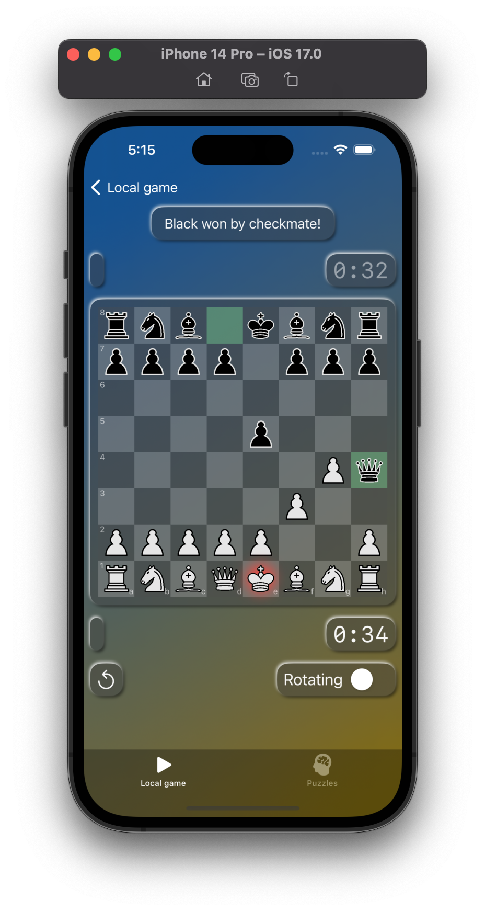
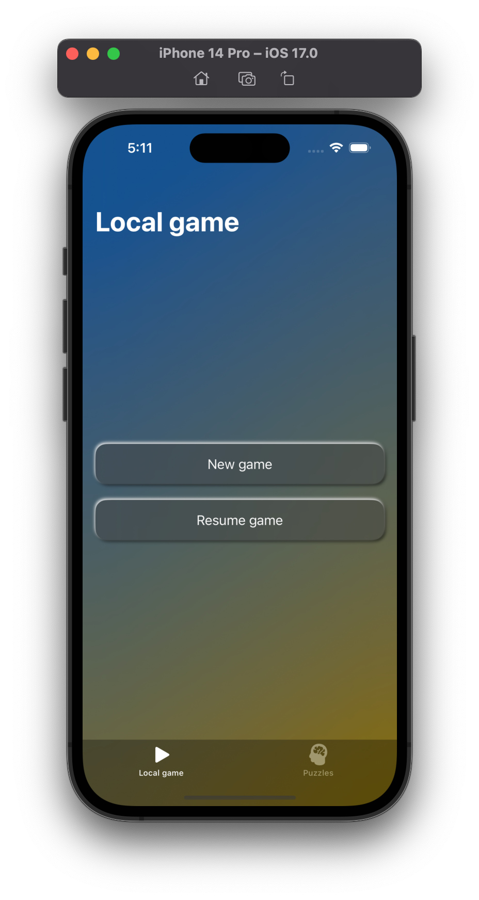
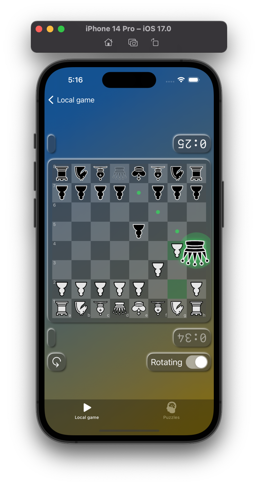
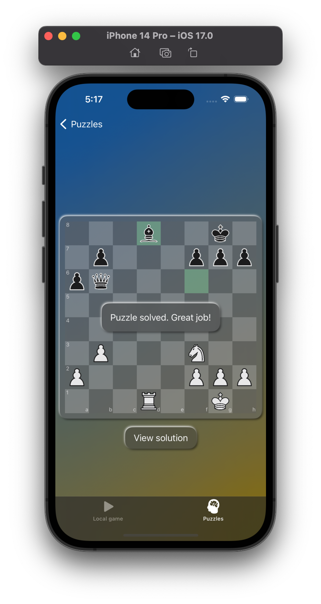
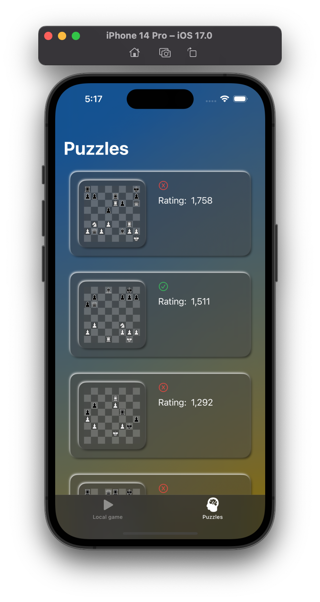
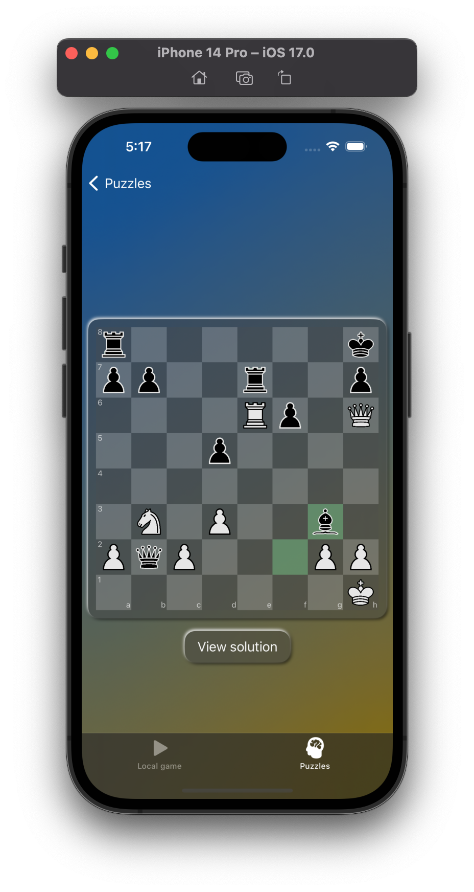

# Chessy

## Table of contents
- [Description](#description)
- [General info](#general-info)
- [Usage](#usage)
- [Technologies](#technologies)

## Description
This project is simple chess application in glassmorphism style for iOS where you can play locally with human opponent (bots, puzzles and online games are in todo list), below you can see some UI images of app running on iPhone 14 Pro (iOS 16.4).

  

Also you can play almost 1000 puzzles from lichess database stored in the app with no need of internet connection.

   

## General info
You can play with some other player locally on your device using taps or drag gestures, additionally you can input FEN position to start playing from any position you want. You can also undo moves and add time by clicking on timer (although timer not really working because when its reaching 0 seconds nothing happens, will fix it later), also you can choose to rotate board pieces and time for second player. Btw game state and time saves when you close application. If you want to start new game just shake your phone or input empty FEN string in field.

Some features are:
* Use drag gesture to make moves
* You can rotate board pieces and other UI when playing locally against other player
* You can undo move when playing locally
* You can shake your phone to start a new game
* Position of last game is saved when you leave an app
* You can solve different level puzzles
* Auto Layout is supported, so you can play in landscape orientation if you wan to

## Usage
For installation and usage just clone this git repo and open it via xcode, choose device destination, build and run application.
```
git clone https://github.com/yasha424/Chessy
```

## Technologies
Project is created with:
* Swift: 5.9
* SwiftUI
* Combine
